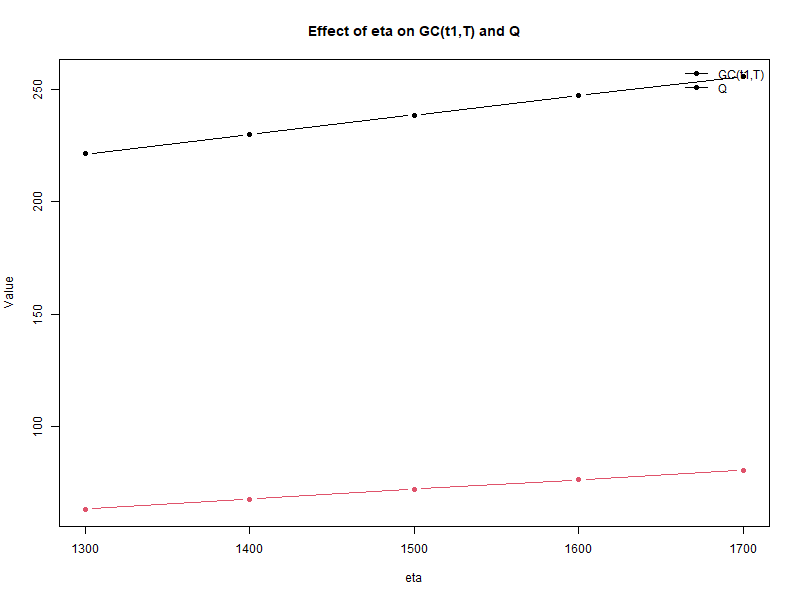

[](https://doi.org/10.5281/zenodo.20407468)

# Fuzzy Inventory Model for Deteriorating Items

This repository provides a reproducible R implementation, sensitivity analysis, and reported-vs-computed validation of a published fuzzy inventory model for deteriorating items.

## Project Aim

The aim of this project is to convert an inventory model from my research work into a reproducible computational format, including numerical experimentation and graphical interpretation.

## Key Results

The R implementation reproduces the reported crisp and fuzzy model results closely.

### Crisp Model

- Reported total cost: 245.1534
- Computed total cost: 245.1533
- Difference: -0.000108

### Fuzzy Model

- Reported fuzzy total cost: 239.4447
- Computed fuzzy total cost: 239.44596
- Difference: 0.001258

These small differences indicate that the R implementation successfully reproduces the reported numerical results.

## Generated Outputs

This repository includes generated CSV tables, plot images, and written reports produced from the R scripts.

### Selected Output Plots

#### Sensitivity Analysis Plot



*Figure: Effect of demand parameter eta on fuzzy total cost `GC(t1,T)` and total order quantity `Q`.*

### Crisp and Fuzzy Model Output Evidence

The repository includes reported-vs-computed comparison tables for both crisp and fuzzy models:

- `outputs/tables/crisp_model_reported_vs_computed.csv`
- `outputs/tables/fuzzy_model_reported_vs_computed.csv`

### CSV Tables

Generated CSV files are available in:

`outputs/tables/`

These include:

- sensitivity-analysis tables,
- crisp-model computed outputs,
- fuzzy-model computed outputs,
- reported-vs-computed comparison files.

### Plots

Sensitivity-analysis plot images are available in:

`outputs/plots/`

### Summary Reports

Short written reports are available in:

- `report/sensitivity_analysis_summary.md`
- `report/sensitivity_interpretation.md`
- `report/crisp_model_results_summary.md`
- `report/fuzzy_model_results_summary.md`
- `report/final_project_summary.md`

## Reproducibility

The outputs can be regenerated by running:

```r
source("code/sensitivity_analysis_data.R")
source("code/crisp_model_cost_function.R")
source("code/fuzzy_model_cost_function.R")
```

## Research Area

- Operations Research
- Inventory Modelling
- Deteriorating Items
- Fuzzy Modelling
- Optimisation
- Sensitivity Analysis

## Completed Work

- Model description
- Parameter table
- Sensitivity-analysis data entry in R
- Generated CSV output tables
- Generated sensitivity-analysis plots
- Short sensitivity-analysis summary
- Sensitivity-analysis interpretation
- Crisp model cost-function implementation in R
- Reported-vs-computed comparison for crisp model
- Fuzzy model cost-function implementation in R
- Reported-vs-computed comparison for fuzzy model
- Final technical project summary

## Future Extensions

Possible future extensions include:

- expanding the interpretation of sensitivity-analysis results,
- adding further sensitivity scenarios,
- comparing crisp and fuzzy inventory decisions under alternative parameter assumptions,
- developing a more general reusable R function for similar inventory models.

## Limitations

This repository is a computational reproduction and documentation project based on a published inventory model.

The implementation focuses on reproducing reported numerical results, sensitivity-analysis tables, and generated plots. It does not claim to introduce a new inventory model.

Known source-documentation issues are recorded in `report/computational_notes.md`.

## Tools

- R
- GitHub
- Markdown

## Dependencies

This project uses base R functions for data handling, plotting, numerical computation, and CSV export.

No external R packages are required for the current version.

The scripts were developed and tested using RStudio.

## Citation

If using this repository, please cite it as:

Shaikh, T. S. (2026). *Fuzzy Inventory Model for Deteriorating Items: Reproducible R Implementation and Sensitivity Analysis* (Version 1.0.0) [Computer software]. Zenodo. https://doi.org/10.5281/zenodo.20407468

This repository is a computational companion to:

Shaikh, T. S., & Gite, S. P. (2024). Fuzzy Inventory Model under Selling Price Dependent Demand and Variable Deterioration with Fully Backlogged Shortages. *American Journal of Operations Research*, 14, 87–103. https://doi.org/10.4236/ajor.2024.142005

## Author

Dr. Tanzim Shahabuddin Shaikh  
Assistant Professor of Statistics  
Ph.D. in Statistics, University of Mumbai  
Mumbai, India  

ORCID: https://orcid.org/0009-0002-6226-387X  

Research areas: Operations Research, Inventory Modelling, Fuzzy Modelling, Applied Statistics, Statistical Modelling
